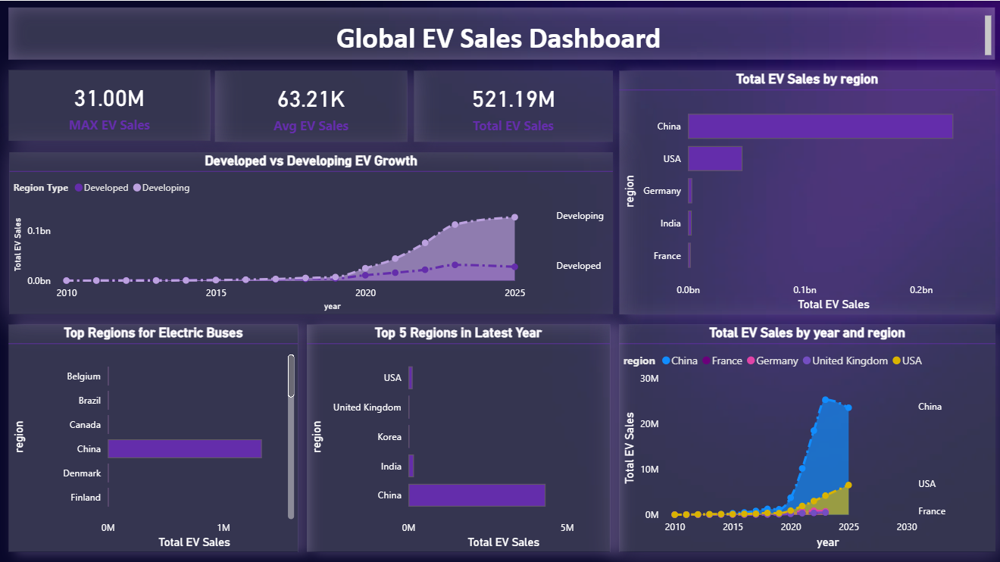
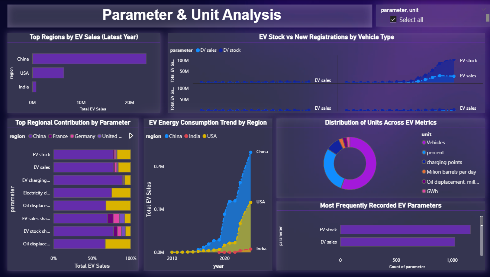

# EV-Sales-and-Energy-Analysis
📌 Project Overview

This project presents a 4-page interactive Power BI dashboard analyzing global Electric Vehicle (EV) sales, growth trends, powertrain adoption, and energy consumption. The dashboard is designed to provide actionable insights for understanding market trends and supporting data-driven decision-making.

# Dashboard Pages
Overview: Key KPIs, regional sales distribution, and overall trends
Powertrain Analysis: Comparison of BEV, PHEV, and FCEV adoption
Parameter Analysis: EV stock, energy consumption, and unit-level insights
Yearly Trends: Growth patterns and year-over-year comparisons

# Tools & Technologies
Power BI
Excel / CSV Dataset
Data Cleaning & Transformation
Data Visualization

# Key Insights
China leads global EV sales with significant growth after 2020
BEVs dominate the market compared to other powertrain types
EV adoption shows rapid acceleration in recent years
Regional trends highlight emerging markets and growth opportunities

# Dashboard Preview
🔹 Overview Page

🔹 Powertrain Analysis

🔹 Parameter Analysis

🔹 Yearly Trends

# Project Files
EV Sales.pbix – Power BI dashboard file

# How to Use
Download the .pbix file
Open using Power BI Desktop
Explore interactive dashboard

# Future Improvements
Add real-time data integration
Enhance with drill-through features
Deploy on Power BI Service for live interaction
